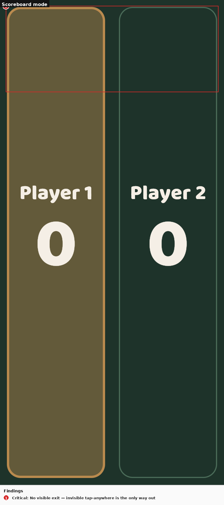
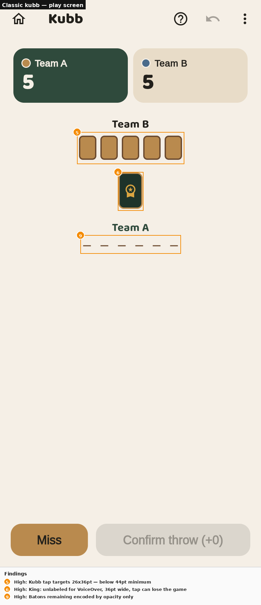
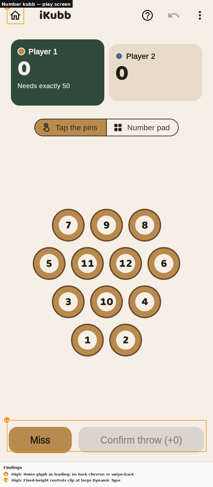
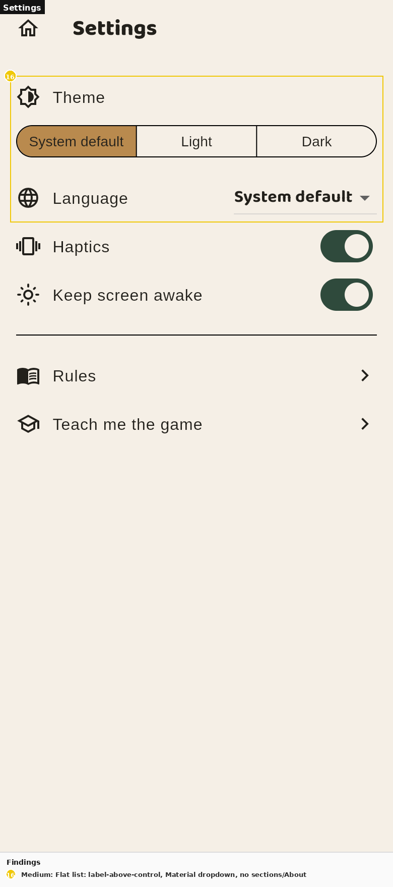

# iKubb — Quality audit: UX · WCAG AA · brand & copy · Apple HIG

**Date:** 2026-07-26 · **Artefacts:** full codebase (`lib/`, `test/`) plus
21 headless screenshots of the web build (light/dark, phone 390×844 and iPad
1180×820) · **Scope:** both game modes, all screens, all 10 locales (English
as copy master).

## Executive summary

The app's foundations are strong — a replay-based engine that makes undo and
resume free, resume-first navigation, progressive-disclosure rules, an
AA-checked palette and a distinctive wooden brand. The audit still surfaces
**4 critical, 10 high, 8 medium and 3 low** findings. The top three: the
scoreboard screen has **no visible or accessible exit** (an invisible
tap-anywhere is the only way back — a VoiceOver trap); a **corrupt saved game
crashes the app at launch** (unguarded `loadActive()` in `main.dart`); and the
classic-kubb play surface is **largely invisible to assistive technology and
under Apple's 44pt touch minimum** (26×36pt kubb blocks, a 36pt-wide king whose
tap can lose the game, state conveyed by opacity alone). A systemic finding
underlies many of the rest: styling is built from ~200 magic numbers and eight
near-duplicated component implementations, which is how the inconsistencies
(two dot-row idioms, two section headers, five confirm dialogs) crept in.

## Method and lenses

Evidence: static analysis of every screen's source (file:line cited per
finding) plus screenshot review; interaction-dependent claims that a static
image cannot prove are marked **to verify**. Lenses: **Nielsen's 10** (primary
usability), **Laws of UX** (Fitts, Hick, Jakob, Tesler, Aesthetic–Usability),
**Gestalt/Norman** (affordance, feedback, mapping), **WCAG 2.2 AA** (deep pass:
contrast, target size, non-color encoding, semantics, motion, text scaling),
**HIG** (navigation, gestures, haptics, Dynamic Type, destructive actions,
adaptive components) and **content design** (voice, terminology, microcopy) —
chosen because the stated goal is a strict pre-growth quality pass, not
conversion optimisation.

## What's working

- **Replay-first engine.** Every mutation is an event; undo, resume and stats
  derive from one source of truth. This is why resume "just works" mid-turn.
- **Resume-first Home** — an interrupted game takes over the primary action
  with live standings in the label (Zeigarnik put to work).
- **Progressive disclosure done right** in the rules panel: categories → short
  cards → edge-case details, searchable across both modes with mode tags.
- **Deliberate motion policy** (state first, animation as decoration) and
  Reduce Motion already honoured on confetti and the mascot.
- **Brand carries through play**: the wooden pieces, the mascot reactions and
  the bundled Baloo 2 give the app a recognisable voice with no CDN fetches.
- Adaptive dialogs (`AlertDialog.adaptive`) and `Icons.adaptive` are already
  the norm; tooltips exist on every AppBar icon button.

## Findings

Severity counts: **4 Critical · 10 High · 8 Medium · 3 Low.**

### 1. Scoreboard has no visible or accessible exit — Critical
- **Where:** `/scoreboard`, both variants (`lib/features/game/scoreboard_screen.dart:40-42, 97-99`); annotated shot below.
- **Heuristic:** Nielsen #3 User control and freedom; WCAG 2.1.2 (keyboard/AT trap by analogy).
- **Observation:** the whole screen is one invisible `GestureDetector(onTap: pop)`. There is no close button, no AppBar, no hint that tapping exits; the gesture has no `Semantics`, so VoiceOver users have **no way to leave**.
- **Why it matters:** anyone who props up the iPad and later taps expecting interaction may exit accidentally; an AT user is stuck.
- **Recommendation:** add a visible close (X) button with tooltip and `Semantics(button:)`, keep tap-anywhere as a bonus.

### 2. Corrupt saved game crashes the app at launch — Critical
- **Where:** `lib/main.dart:12` — `await GameRecordsRepository().loadActive()` with no error handling.
- **Heuristic:** Nielsen #5 Error prevention.
- **Observation:** a malformed active-game record (schema change, interrupted write) throws before the first frame; the app becomes unopenable until reinstall.
- **Recommendation:** wrap in `try/catch`, fall back to `null` (fresh start) and clear the bad record.

### 3. Raw exception text as the stats error state — Critical
- **Where:** `lib/features/stats/stats_screen.dart:47` — `error: (e, _) => Center(child: Text('$e'))`.
- **Heuristic:** Nielsen #9 Help users recognize, diagnose, recover.
- **Observation:** users can be shown `FormatException: Unexpected character…` — unlocalized, no explanation, no retry.
- **Recommendation:** localized friendly error state with mascot + retry button.

### 4. "Keep screen awake" silently does nothing in classic kubb and scoreboard — Critical
- **Where:** wakelock handled only in `game_screen.dart:55-60`; `kubb_screen.dart` and `scoreboard_screen.dart` have none.
- **Heuristic:** Nielsen #2 Match between system and the real world (a promise the UI breaks).
- **Observation:** the settings toggle claims to keep the screen awake, but the longer-format mode (with a turn clock) and the across-the-field scoreboard — the two screens that need it most — let the device sleep.
- **Recommendation:** extract a `KeepAwake` wrapper and use it on `/game`, `/kubb` and `/scoreboard`.

### 5. Kubb play targets far below the 44pt minimum — High
- **Where:** `KubbBlock` 26×36pt (`kubb_field.dart:13-14`), field row 22×30pt (`kubb_screen.dart`), advantage chip ≈22pt tall, miss-dot rule link in a 16pt slot (`game_screen.dart:505-531`).
- **Heuristic:** HIG touch targets / WCAG 2.5.8 Target size; Fitts's law.
- **Observation:** the most frequent in-game gesture (marking a felled kubb) is a 26pt-wide box with 3px margins between identical siblings — mis-taps mark the wrong kubb.
- **Recommendation:** keep visuals, expand hit areas to ≥44×44 (constrained `GestureDetector` boxes around each block, chip and dot link).

### 6. The king — an instant-loss tap — is small, unlabeled and its confirm isn't destructive-styled — High
- **Where:** `kubb_field.dart:54-64` (36pt wide, bare `GestureDetector`, no `Semantics`); warning dialog confirm is a plain `TextButton` (`kubb_screen.dart:93-96`).
- **Heuristic:** Nielsen #5 Error prevention; HIG destructive actions.
- **Observation:** an accidental king tap when kubbs still stand loses the game; the guard dialog exists, but its confirm looks identical to Cancel and VoiceOver reads the king as nothing at all.
- **Recommendation:** ≥44pt hit area, `Semantics` label that includes the risk state, destructive (error-colored) confirm action.

### 7. The play surface is invisible to VoiceOver — High
- **Where:** only one `Semantics` widget exists in the app (`pin_diagram.dart:75-78`). Kubb blocks/rows, king, baton dots, miss dots, match dots, color swatches, tour mode option and both steppers have no labels (`kubb_field.dart`, `kubb_screen.dart:326-332, 471-477, 671-689`, `tour_screen.dart:264`).
- **Heuristic:** WCAG 4.1.2 Name, role, value; 1.1.1 Non-text content.
- **Observation:** classic kubb cannot be played, or even understood, with VoiceOver.
- **Recommendation:** semantic labels + roles + selected states on every interactive/piece widget; merged live summaries for dot rows ("2 of 6 batons thrown").

### 8. No iOS swipe-back, and the leading control changes meaning per entry path — High
- **Where:** no `pageTransitionsTheme` (`ikubb_theme.dart`); `home_leading.dart:10-17` swaps between back chevron and a Home glyph; `rules_screen.dart:25` uses `go('/tour')`, replacing Rules in the stack.
- **Heuristic:** HIG navigation; Jakob's law.
- **Observation:** iOS users' most ingrained gesture (edge swipe) does nothing anywhere; the same screen shows different leading icons depending on how it was reached; replaying the tour from Rules destroys the Rules stack entry.
- **Recommendation:** `CupertinoPageTransitionsBuilder` for iOS/macOS, `push` for the tour from Rules, keep the hub model but document it.

### 9. Game state encoded by color/opacity alone — High
- **Where:** baton dots (opacity, `kubb_screen.dart:326-332`), miss dots (color, `game_screen.dart:522-528`), match dots (color, `kubb_screen.dart:471-477`).
- **Heuristic:** WCAG 1.4.1 Use of color.
- **Observation:** "how many batons are left" — core turn information — is a row of icons differing only in alpha.
- **Recommendation:** shape difference (filled vs outlined) + semantic count labels via a shared `DotRow`.

### 10. History delete is swipe-only with no undo and no accessible path — High
- **Where:** `stats_screen.dart:114-120` (`Dismissible`, endToStart only).
- **Heuristic:** WCAG 2.5.7 Dragging movements; Nielsen #3.
- **Observation:** deletion requires a drag gesture; AT and switch users have no equivalent; a slip permanently deletes a game with no confirmation or undo.
- **Recommendation:** confirm destructive delete, and expose delete as a semantic action / long-press alternative.

### 11. Reduce Motion is only partially honoured — High
- **Where:** honoured in confetti/mascot; ignored by pin knock-over (`pin_diagram.dart:81-87`, rotating overshoot spring), kubb topple (`kubb_field.dart:31-37`), score odometer (`rolling_number.dart:13`), win-overlay zoom (`win_overlay.dart:52`), page-indicator and misc `AnimatedContainer`s.
- **Heuristic:** WCAG 2.3.3 Animation from interactions; HIG motion.
- **Recommendation:** central motion tokens whose durations collapse to zero under `MediaQuery.disableAnimationsOf`.

### 12. The kubb "new game" dialog destroys a *match* but says *game* — High
- **Where:** `kubb_screen.dart:114` reuses `newGameConfirmTitle/Body` ("Start a new game? The current game will be discarded") while discarding a best-of-3 match.
- **Heuristic:** Nielsen #2; content design (say what actually happens).
- **Recommendation:** dedicated match-scoped strings for classic kubb.

### 13. Terminology drifts across the two modes — High
- **Where:** ARB master: "stick" vs "baton" for the thrown implement; "pin" vs "kubb"; engine word "side" leaking into rule copy ("Sides throw one stick per turn"); fell/felled/topple/knock over all coexist; `ruleLeaningBody` mixes pin and stick in one sentence.
- **Heuristic:** Nielsen #4 Consistency and standards; content design.
- **Recommendation:** glossary — number kubb throws *sticks* at *pins*; classic kubb throws *batons* at *kubbs*; the king is *toppled*, everything else is *knocked over*; user-facing copy says *player/team*, never *side*. Apply across all 10 locales.

### 14. Dynamic Type unbounded and fixed-height text containers — High
- **Where:** no text-scale handling anywhere (`app.dart:15-24`); `NumberPad` buttons in fixed `SizedBox(68×60)` / Miss in `220×56` (`number_pad.dart:37-47`); miss-dot slot `SizedBox(height:16)`; names truncate with ellipsis in 8 places.
- **Heuristic:** WCAG 1.4.4 Resize text; HIG Dynamic Type.
- **Observation:** at accessibility text sizes, pad numerals clip and the localized Miss label overflows its fixed box; nothing clamps the scale on layout-critical screens.
- **Recommendation:** clamp scale via `MaterialApp.builder` (2.0 global, tighter on the field), replace fixed boxes with minimum constraints.

### 15. Haptic language is inconsistent — Medium
- **Where:** 3 call sites; pin/kubb selection taps silent, undo silent, steppers silent, overshoot (a bad outcome) feels identical to a normal score.
- **Heuristic:** HIG playing haptics; Norman feedback.
- **Recommendation:** shared `Haptics` helper honoring the setting: selection clicks on piece taps and steppers, medium on overshoot/warnings, heavy on wins — identical in both modes.

### 16. Settings is a flat, half-Material list — Medium
- **Where:** `settings_screen.dart:32-121` — label-only Theme tile above a detached segmented control, Material `DropdownButton` for language, one bare divider as grouping, no About/version/licenses row, wakelock icon is a brightness glyph.
- **Heuristic:** HIG settings patterns; Gestalt proximity.
- **Recommendation:** grouped sections via shared settings-tile components; add About (version + licenses); clearer icons; "Teach me the game" re-titled for a settings row context.

### 17. Empty/loading states underperform — Medium
- **Where:** stats empty state has no action (`stats_screen.dart:49-60`); a mode filter with no matches renders a header above nothing; a spinner shows for a fast local read.
- **Heuristic:** Nielsen #1 Visibility of status; Goal-gradient (give the next step).
- **Recommendation:** "New game" CTA in the empty state; per-filter empty message; skip the spinner for local reads.

### 18. Setup miss-limit stepper has no bounds and both steppers lack labels — Medium
- **Where:** `setup_screen.dart:536-550` (no disabled state, unlike the kubb stepper); both steppers tooltip-less.
- **Heuristic:** Nielsen #5; WCAG 4.1.2.
- **Recommendation:** clamp with disabled buttons at the limits; tooltips on all steppers.

### 19. Unclear labels at decision points — Medium
- **Where:** `outTwice` "Out of bounds twice" as a bare stepper label (what is being counted?); `policyReset` "Reset" (to what?); `activeRulesLabel` "This game"; `mostHitPin` "Favorite pin" (it's the most-hit pin).
- **Heuristic:** content design (front-load meaning); Nielsen #2.
- **Recommendation:** "Penalty kubbs (out twice)", "Back to {score}", "House rules in play", "Most-hit pin".

### 20. Hardcoded string concatenation blocks localization — Medium
- **Where:** resume label `'${l10n.resumeGame} — $summary'` (`home_screen.dart:82`), `'${l10n.confirmThrow} (+$n)'` (`kubb_screen.dart:369`), score line `'${wins[0]} – ${wins[1]}'`, avatar initial `name[0].toUpperCase()` (breaks on emoji/uncased scripts).
- **Heuristic:** i18n correctness (10-language app).
- **Recommendation:** ARB placeholders (`resumeGameSummary`, `confirmThrowCount`, `matchScore`); `characters`-safe initial.

### 21. Share preview uses non-adaptive dialogs, duplicated per mode — Medium
- **Where:** `share_card.dart:24, 61` — two `showDialog` blocks differing in one line.
- **Heuristic:** consistency; HIG adaptive components.
- **Recommendation:** one shared share-dialog with one card component.

### 22. Styling is magic numbers; components are copy-pasted — Medium (systemic)
- **Where:** 91 `EdgeInsets` + 87 `SizedBox` + 18 radius + 18 duration literals; share cards ~95% duplicated, scoreboard columns ~90%, standings ~85%, overlays ~70%, 5 confirm dialogs, 5 dot rows, 2 section headers, 9 copies of the overlay button style.
- **Heuristic:** Tesler (complexity has to live somewhere — currently in every file); consistency.
- **Recommendation:** token scales (spacing/radius/motion/alpha/icon/type steps) + ~10 shared components; this is the enabler for most fixes above.

### 23. Punctuation and capitalization drift — Low
- **Where:** title keys holding unpunctuated full sentences (`throwInTitle`), validation strings without periods, em-dash inside a button label (`startScoring`), `&` in category labels vs `=` in a rule title, "System default" vs Apple's "System".
- **Heuristic:** content design polish.
- **Recommendation:** style rules — sentence case everywhere; periods on full sentences, none on labels/buttons; no em-dashes in buttons.

### 24. Tone wobbles between playful brand voice and system-speak — Low
- **Where:** "The field awaits!" and "two jackets and a good guess" vs passive "The current game will be discarded."; "Never too early" title contradicts its own body; `comingSoon` is a dead placeholder key.
- **Heuristic:** brand voice consistency.
- **Recommendation:** warm-active voice in dialogs ("You'll lose the current match"), retitle the early-king card, delete dead keys.

### 25. Rules search dead-end — Low
- **Where:** `rules_view.dart:142` — "No rules match your search" with no clear-search affordance.
- **Recommendation:** add a clear button to the search field.

## Annotated screenshots

| Screen | Findings shown |
|---|---|
|  | #1 |
|  | #5 #6 #9 |
|  | #8 #14 |
|  | #16 |

## Prioritised recommendations

1. **Quick wins (this pass):** scoreboard close button (#1), launch-crash guard (#2), stats error state (#3), `KeepAwake` on all three screens (#4), destructive dialog styling (#6, #10), stepper bounds/tooltips (#18).
2. **Foundation:** token scales + shared components (#22) — then land touch
   targets (#5), semantics (#7), non-color encoding (#9), Reduce Motion (#11),
   haptics (#15) and Dynamic Type (#14) *on* those components.
3. **Copy pass:** glossary + clarity + punctuation (#12 #13 #19 #20 #23 #24),
   propagated to all 10 locales in the same change.
4. **Navigation & platform:** Cupertino transitions, tour push, settings IA
   (#8 #16 #21), plus a11y guideline tests so regressions fail CI.

All items are executed in this change series; the `/designsystem` review page
documents the resulting tokens and component states.

## Appendix: frameworks referenced

Nielsen's 10 usability heuristics · Laws of UX (Fitts, Hick, Jakob, Tesler,
Zeigarnik, Aesthetic–Usability, Goal-gradient) · Gestalt principles & Norman's
affordance/feedback model · WCAG 2.2 AA (1.1.1, 1.4.1, 1.4.4, 2.1.2, 2.3.3,
2.5.7, 2.5.8, 4.1.2) · Apple Human Interface Guidelines (navigation, gestures,
touch targets, Dynamic Type, haptics, destructive actions, adaptive
components) · Content-design microcopy practice.
